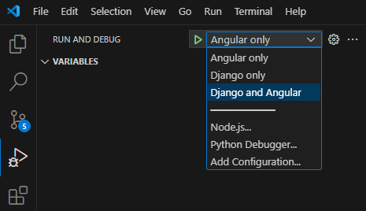

# Getting started

This guide will help you set up your development environment and get started with the project.

## Combined start with VSCode

If you are using Visual Studio Code, you can use the Run and Debug feature to start both the Angular frontend and Django backend at the same time. A configuration for this is provided in the `.vscode/launch.json` file.

1. First, make sure you have all requirements installed as described in the Angular and Django sections below.

2. Open the Run and Debug view by clicking on the icon in the activity bar on the side of the window (see the image below).

3. Choose to start either the Angular or Django server separately or to start both at the same time in the dropdown menu.

4. Click on the "Play" button, select "Run > Start Debugging" from the menu or press F5 to start.



## Angular

Install Node.js and npm: <https://nodejs.org/en/download>

Install angular with `npm`:
```bash
npm install -g @angular/cli
```

_Stop here if you are starting the server with the debugger in VSCode._

Navigate to the frontend directory:
```bash
cd frontend
```

Start the Angular server:
```bash
npm start
```

Open your browser and navigate to <http://localhost:4200>


## Django Backend

Create a virtual environment:
```bash
python -m venv .venv
```

Activate the virtual environment:
```bash
# On Windows
.venv\Scripts\activate

# On macOS and Linux
source .venv/bin/activate
```

Install the required packages:
```bash
pip install -r requirements.txt
```

_Stop here if you are starting the server with the debugger in VSCode._

Go to the backend directory:
```bash
cd backend
```

Run the Django server:
```bash
# This will fill the database with example data and then start the server
python manage.py flushdatabase
```
```bash
# This will only start the server
python manage.py runserver
```